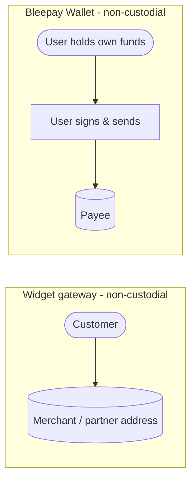

# Custody Model

> Non-custodial across both products; Bleepay never holds users' funds.

"Custody" means holding, or being able to control and move, another party's funds or the keys to them. **Bleepay is non-custodial across both products** — it never holds users' funds.

| Product / path | Custody | What it means |
|----------------|---------|----------------|
| **Bleepay Widget (gateway)** | **Non-custodial** | Funds land at the merchant's own address (or a partner's address for fiat payouts) — never an address Bleepay controls |
| **Bleepay Wallet (vouchers)** | **Non-custodial** | The Bleepay Wallet is a mobile app where the user holds their own funds and keys; Bleepay only builds the transaction, the user signs and sends it |

- On the **gateway**, payments move directly from the customer to the merchant's (or a partner's) address. Bleepay's role is to monitor the blockchain, validate each payment, and notify the merchant.
- In the **Bleepay Wallet**, the user controls their own funds. Bleepay generates the transactions linked to a voucher; the user **signs and broadcasts them from the iOS / Android app** with their own keys.

> The only party other than the user and merchant that ever holds funds is the **fiat payout partner**, and only transiently during the crypto→fiat off-ramp.

## Next steps

* [Security](/home/architecture/security) — zero-trust and non-custodial model.
* [How money moves](/home/architecture/how-money-moves) — fund flows by scenario.
