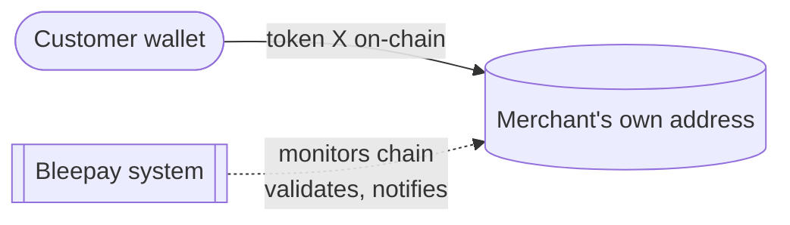
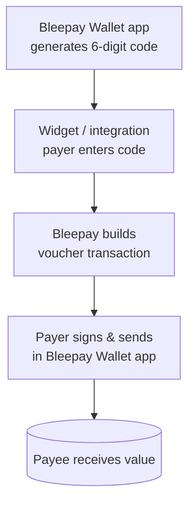
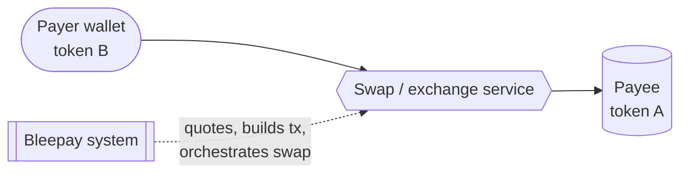
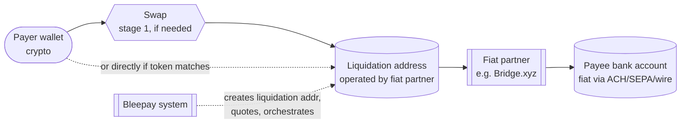

# Payment Flows

> Four flows, from a plain same-token deposit to a full crypto→fiat payout.

## Widget deposit (same token)

The base case: a customer pays a merchant on-chain, in the token the merchant accepts, with no conversion.

1. **Merchant configures a Widget** — mode, min/max, accepted networks/currencies, the destination wallet address, domain restrictions, optional metadata. A client secret is issued for embedding.
2. **Merchant embeds the Widget** on their site.
3. **Customer opens the Widget** — it fetches public config; the system validates the Widget is active and (if set) the host domain is allowed.
4. **Widget creates a Deposit Session** — the system validates every field (amount within min/max, allowed network, allowed currency, deposit address in the allowed list, metadata against schema), creates the session in `CREATED` status with a **30-minute expiry**, and issues a one-time client secret.
5. **Customer sends funds** from their own wallet to the deposit address.
6. **Payment detected** — the system matches the on-chain transaction to the session; status → `PENDING`; `deposit.pending` webhook dispatched.
7. **Payment confirmed** — after required block confirmations, status → `CONFIRMED`; transaction hash and timestamp recorded; `deposit.confirmed` webhook dispatched.
8. **Merchant notified** — a signed (HMAC-SHA256) webhook to each registered endpoint; up to 3 retries at 30-second intervals.

Edge cases: `EXPIRED` (no funds in 30 min), `UNDERPAID`, `OVERPAID`, customer cancellation (only from `CREATED`/`PENDING`), and domain-restriction blocks.

Funds move directly from the customer's wallet to the merchant's own address; Bleepay monitors, validates, and notifies.

## Voucher payment (6-digit code)

1. A **6-digit code** (voucher) is generated in the Bleepay Wallet.
2. The payer **enters the code in the Widget** (or a standalone integration).
3. Bleepay **builds the transaction(s)** associated with the voucher (lifecycle **reserve → redeem → resolve**):
   - **reserve** — the voucher is set aside for a payment;
   - **redeem** — the payee defines the expected payment (currency, amount, recipient), making it **SIMPLE**, or supplies explicit networks/payments/extras, making it **CUSTOM**;
   - **resolve** — the transaction is finalised for signing.
4. The payer **signs and sends** the transaction in the Bleepay Wallet app, from their own funds.

The payer holds their own funds throughout; Bleepay prepares the transaction but the payer signs and broadcasts it. A SIMPLE voucher can also carry FX.

## FX — crypto ↔ crypto

In-flight conversion between two crypto-assets on the same blockchain network, so a payee can be paid in one token while the payer pays in another.

1. **Payee sets the expected payment** — e.g. "I want 100 USDC."
2. **Payer chooses a different currency** — e.g. "I'll pay with ETH," giving their wallet address.
3. **System calculates the rate** — looks up market prices, gets a quote from one of several integrated exchange providers, accounts for fees and slippage, and determines the exact amount the payer must send.
4. **Conversion executes on resolve** — the swap runs as part of the payment; the payee receives the requested token.

Constraints: SIMPLE vouchers only; both currencies on the same network; both must be swap-supported ("bridgeable"); a minimum value may apply.

Bleepay integrates **multiple swap/exchange providers** and routes each pair to a suitable one, rather than relying on a single venue.

## FX & fiat off-ramp (crypto → bank account)

The payee receives traditional money in a bank account while the payer pays in crypto. The conversion to fiat and the bank transfer are handled by a fiat integration partner.

1. **Payee sets a fiat expected payment** — currency (USD, EUR, GBP, …), amount, bank account details, and a payment rail (ACH, wire, SEPA, Faster Payments).
2. **A liquidation address is created** — Bleepay contacts a fiat off-ramp partner (e.g. **Bridge.xyz**), which returns a dedicated crypto deposit address configured to convert incoming crypto to fiat and pay the bank account.
3. **Payer chooses a crypto to pay with**.
4. **System calculates the rate** — including any crypto→crypto step, crypto→fiat fees, bank-transfer fees, and margins.
5. **Two-stage conversion on resolve:**
   - **Stage 1 (if needed):** crypto→crypto swap so the token matches what the liquidation address expects.
   - **Stage 2:** crypto arrives at the liquidation address; the **partner** detects it, converts crypto→fiat, and sends fiat to the payee's bank via the chosen rail.

A liquidation address is a single-purpose crypto address: crypto in → fiat out to a preset bank account, created per payment by the partner. Because a fiat payout is involved, the receiving merchant completes KYC/KYB (see [Onboarding and KYC/KYB](/home/architecture/onboarding-kyc-kyb)).

## Next steps

* [How money moves](/home/architecture/how-money-moves) — who holds funds at each step.
* [Custody model](/home/architecture/custody-model) — non-custodial design.
* [Security](/home/architecture/security) — zero-trust model.
