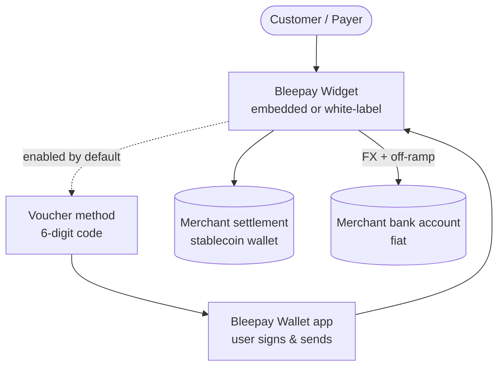

# System Overview

Bleepay offers two complementary products. They can be used independently, but the second is designed to plug into the first.

## Bleepay Widget — a crypto payment gateway

A merchant integrates Bleepay by embedding the Widget or via a white-label integration, and can then accept cryptocurrency payments from their customers. The customer pays in a supported token; the merchant can settle in a stablecoin or have Bleepay convert the payment to fiat and pay out to a bank account. When the customer's token differs from what the merchant wants, Bleepay arranges the FX in the background.

## Bleepay Wallet & Vouchers — a native payment method

A payment method based on a **6-digit code** (a voucher). It can be integrated standalone or surfaced inside the Widget, where it is enabled by default. The payer enters the code, and confirms the payment in the **Bleepay Wallet** — a mobile app where they sign and send the transaction themselves.

## The two products at a glance

| | Bleepay Widget | Bleepay Wallet & Vouchers |
|---|----------------|---------------------------|
| **What it is** | A crypto payment gateway | A code-based payment method + wallet app |
| **Who integrates it** | Merchant (embedded or white-label) | Merchant (standalone, or inside the Widget) |
| **How the customer pays** | Sends crypto via a simple form | Enters a 6-digit code, confirms in the app |
| **Settlement for the merchant** | Crypto (same token or stablecoin) or fiat | Same, including FX |
| **Custody** | Non-custodial | Non-custodial |

## What a merchant can receive (settlement options)

| Option | What the merchant gets | Conversion |
|--------|------------------------|------------|
| **Crypto, same token** | The exact token the customer paid | None |
| **Crypto, different token** | A stablecoin (e.g. USDC/EURC) | Crypto→crypto FX |
| **Fiat to bank account** | Traditional money (EUR, etc.) | Crypto→fiat off-ramp via partner |

## Next steps

* [Bleepay Widget](/home/architecture/bleepay-widget) — the gateway product in detail.
* [Bleepay Wallet](/home/architecture/bleepay-wallet) — vouchers and the wallet app.
* [Payment flows](/home/architecture/payment-flows) — how each flow works end-to-end.
